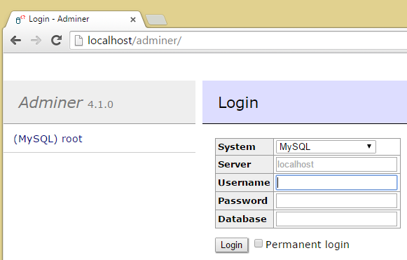

# Using Adminer in WampServer

[Adminer](http://www.adminer.org/) is a lightweight alternative to phpMyAdmin. This is how to add it to WampServer 2.5:

 1. [Download adminer](http://www.adminer.org/#download), e.g. the all-in-one version (the first link in the *Downloads* section)
 2. Save it as `C:\wamp\apps\adminer\index.php`
 3. Save the [adminer.conf](./adminer.conf) file to the `c:\wamp\alias` folder
 4. Restart WampServer

Adminer is now available at `http://localhost/adminer/`.

An example of this file:
    
    Alias /adminer "c:/wamp/apps/adminer/"
    
    <Directory "c:/wamp/apps/adminer/">
       Options Indexes FollowSymLinks MultiViews
       AllowOverride all
      <IfDefine APACHE24>
        Require local
      </IfDefine>
      <IfDefine !APACHE24>
        Order Deny,Allow
    	  Deny from all
    	  Allow from localhost ::1 127.0.0.1
    	</IfDefine>
      php_admin_value upload_max_filesize 128M
      php_admin_value post_max_size 128M
      php_admin_value max_execution_time 360
      php_admin_value max_input_time 360
    </Directory>

