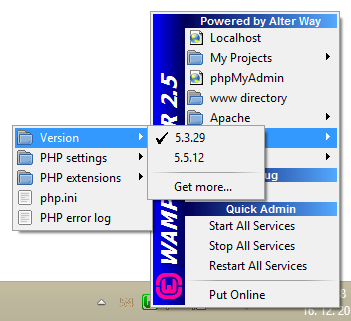

# How to install PHP 5.3.29 on WampServer 2.5 32-bit

[WampServer 2.5](http://sourceforge.net/projects/wampserver/files/WampServer%202/Wampserver%202.5/) comes with PHP 5.5.12 and that version only. This is how to add the [last-ever](http://php.net/archive/2014.php#id2014-08-14-1) PHP 5.3 release to it.

**Important:** this only works on **32-bit** WampServer, not 64-bit

 1. Download [php-5.3.29-Win32-VC9-x86.zip](http://windows.php.net/downloads/releases/php-5.3.29-Win32-VC9-x86.zip) from [windows.php.net](http://windows.php.net/download/#php-5.3)
     - It must be the *thread safe* version
 2. Create new folder `C:\wamp\bin\php\php5.3.29`
 3. Extract the downloaded ZIP there
 4. Copy the file `wampserver.conf` from `php5.5.12` to `php5.3.29`
 5. Copy the sample [php.ini](./php.ini) from this recipe to your `php5.3.29` folder
     - Optionally edit the `date.timezone` option to match your preference
     - See [the diff](https://github.com/borekb/wampserver-recipes/commit/017022239b333b4cf4fb37e5148f6cf31a3f8219) between this working version and the standard `php.ini-development` from which it was created
 6. Copy the `php.ini` to `phpForApache.ini`
 7. Run WampServer
 8. Click the tray icon > *PHP* > *Version* > *5.3.29*

## Manual php.ini creation

If the provided `php.ini` doesn't work for you or you want to create it manually, here is what to do:

First copy the `php.ini-development` to `php.ini` and then replace:

`;error_log = php_errors.log` => `error_log = C:/wamp/logs/php_error.log`  
`register_argc_argv = Off` => `register_argc_argv = On`  
`; extension_dir = "./"` => `extension_dir = "C:/wamp/bin/php/php5.3.29/ext/"`  
`;upload_tmp_dir =` => `upload_tmp_dir = "C:/wamp/tmp"`  
`;date.timezone =` => your timezone, e.g. `date.timezone = Europe/Paris`  
`mysql.default_port =` => `mysql.default_port = 3306`  
`;session.save_path = "/tmp"` => `session.save_path = "C:/wamp/tmp"`  

Then replace the whole extensions block with what is provided in the sample [ini.php](./ini.php).

## References

 - [Forum post that is often linked to](http://forum.wampserver.com/read.php?1,124128)
 - [Detailed blog post](http://john-dugan.com/upgrade-php-wamp/) with screenshots, however, this recipe is somewhat shorter and more straightforward
