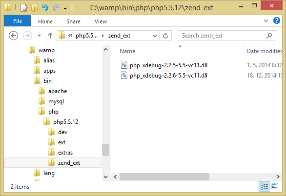

# How to update Xdebug

[WampServer](http://www.wampserver.com/en/) comes with Xdebug preinstalled, for example, WampServer 2.5 comes with Xdebug 2.2.5. This recipe is about how to update the Xdebug version used.

 1. Gather `phpinfo()` data, either by creating a script with `phpinfo()` in it or use `php -i >phpinfo.txt` on the command line
 2. Visit http://xdebug.org/wizard.php
 3. Paste your phpinfo() information and click the *Analyze my phpinfo() output* button
 4. You should get a page like this:
    
    
    
    The instructions are *generally* fine but there are some modifications for WampServer so follow the next steps:
    
 5. Download the DLL file
 6. Put it to `zend_ext` (instead of the suggested `ext` folder), like this:
    
    
    
 7. Update your `php.ini` by setting the `zend_extension` option to the correct value, e.g.:
    
        zend_extension = "c:/wamp/bin/php/php5.5.12/zend_ext/php_xdebug-2.2.6-5.5-vc11.dll"
    
 8. **Repeat the previous step for `phpForApache.ini`**. Don't forget to do this; `php.ini` is for command-line usage, `phpForApache.ini` is used when serving the web pages. 