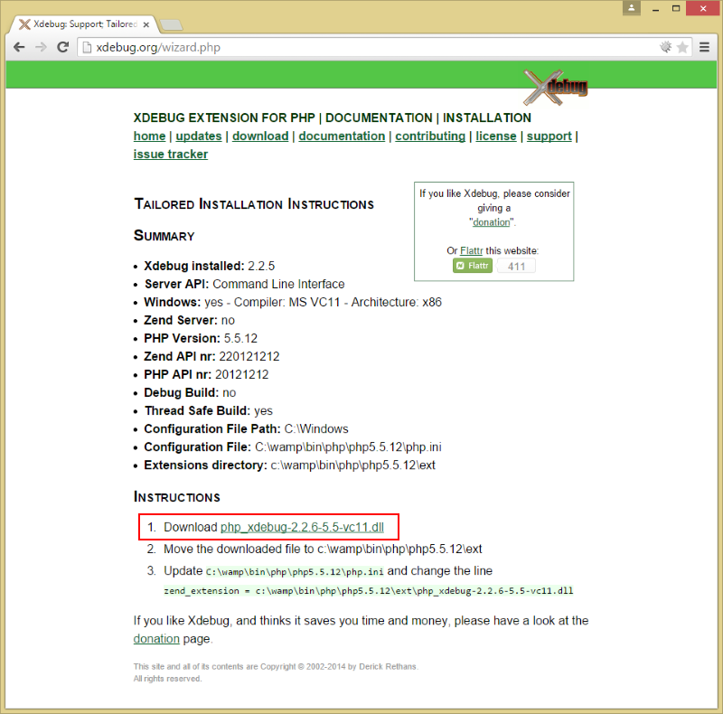

# How to update Xdebug

[WampServer](http://www.wampserver.com/en/) comes with Xdebug preinstalled, for example, WampServer 2.5 comes with Xdebug 2.2.5. This recipe is about how to update the Xdebug version used.

 1. Gather `phpinfo()` data, either by creating a script with `phpinfo()` in it or use `php -i >phpinfo.txt` on the command line
 2. Visit http://xdebug.org/wizard.php
 3. Paste your phpinfo() information and click the *Analyze my phpinfo() output* button
 4. You should get a site like this:
    
    
    
 5. Follow the instructions given